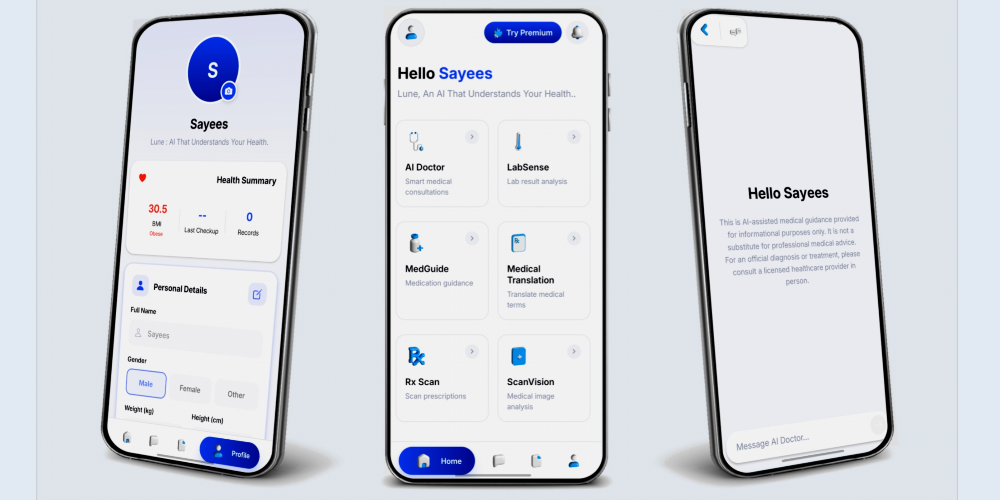

# Lune : Your AI Doctor & Health Companion

Lune is an AI-assisted medical guidance app designed to help users understand their symptoms, get health insights, and maintain wellness through intelligent, conversational assistance.  
Lune is not a replacement for professional medical diagnosis or treatment.

---

## Overview

Lune provides a private and secure chat environment where users can interact with an AI Doctor powered by advanced medical language models.  
Each session gives personalized, symptom-based health insights, lifestyle suggestions, and an intuitive history view for reviewing previous consultations.

---

## Key Features

- AI Doctor Chat — Get instant, AI-assisted medical guidance.  
- Chat History — View your previous medical sessions anytime.  
- Health Disclaimer Banner — Clearly reminds users that Lune is for informational use only.  
- User-Friendly Interface — Clean, calm, and minimal UI designed for focus and comfort.  
- Dark & Light Themes (optional) — Easy on the eyes for night or day use.  
- Cross-Platform Support — Built with Expo for Android and iOS.

---

## Tech Stack

| Layer | Technology |
|-------|-------------|
| Framework | React Native + Expo |
| Routing | Expo Router |
| Backend | Postgres, Railway, NodeJS |
| UI Components | React Native, Expo Image, Custom CSS |
| State Management | React Hooks |
| Styling | Internal StyleSheet (using DM Sans / Inter fonts) |
| Deployment | Railway / Expo Build |

---

## Architecture

The architecture follows a modular React Native pattern:
- **app/** — Core screens and routes  
- **components/** — Reusable UI components  
- **lib/** — Supabase client and utilities  
- **assets/images/** — Static files and visual mockups  
- **server/** — Backend logic (optional)  

---

## Demo

Below is a preview of the Lune application interface:

  

---

## Setup and Installation

1. Clone the repository:
   git clone https://github.com/<your-username>/lune.git
   cd lune

2. Install dependencies:
   npm install

Start the development server:

npx expo start

Disclaimer

Lune provides AI-assisted medical guidance for informational purposes only.
It is not a licensed medical service. For official diagnosis and treatment, please consult a qualified healthcare professional.

Future Enhancements

Symptom tracking dashboard

Health analytics insights

Personalized wellness recommendations

Notifications for follow-up care and reminders

Multi-language support

License

This project is licensed under the MIT License.
You are free to use, modify, and distribute it with proper attribution.

Developer

Maintainer: Muhammed Sayees
